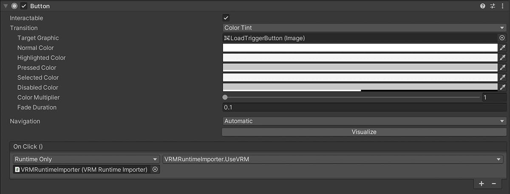

# VRM Runtime Importer

This is a package for adding characters to the screen by loading a VRM file while the Unity application is running.

This package contains UniVrm and the Runtime File Browser. (These are both free and publicly available assets.)

* [UniVrm](https://github.com/vrm-c/UniVRM)
* [Runtime File Browser](https://assetstore.unity.com/packages/tools/gui/runtime-file-browser-113006?aid=1011liAjm)

The UniVrm version of this package is v0.92.0.

Drag and drop the unipackage file into your Unity project.

[VrmRuntimeImporter_1_0_0.unitypackage](https://github.com/EvelynGameDev/VRMRuntimeImporter/releases/)

## Usage

<!-- The following [Youtube video](http://www.youtube.com/watch?v=QSpa_vyYA1Q) explains how to use it in detail. -->

<!--  -->

I have prepared a demo scene, which will help you understand how to use it.

__VRMRuntimeImporter Prefab__

I have a prefab called VRMRuntimeImporter that you can add to the scene you want to use.

You can set the ParentTransform to the parent element where you want the character's game object to appear.

Also, the function registered in Callback will be executed after the VRM file is loaded. You can accept the character's game object as an argument.

Using the UseVRM method of the VRMRuntimeImporter class will open the file browser. Then select the VRM file in the file browser, and the 3D model of the VRM file will appear on the screen.

## License

[MIT](./LICENSE.txt)

## Author

Evelyn GameDev

* [Youtube](https://www.youtube.com/c/EvelynGameDev)
* [Twitter](https://twitter.com/EvelynSoloDev)
* [Blog](https://gamedev.soarhap.com/)

If you like this project, please support my activities.

## 日本語READMEはこちら

[日本語README](./README_jp.md)
