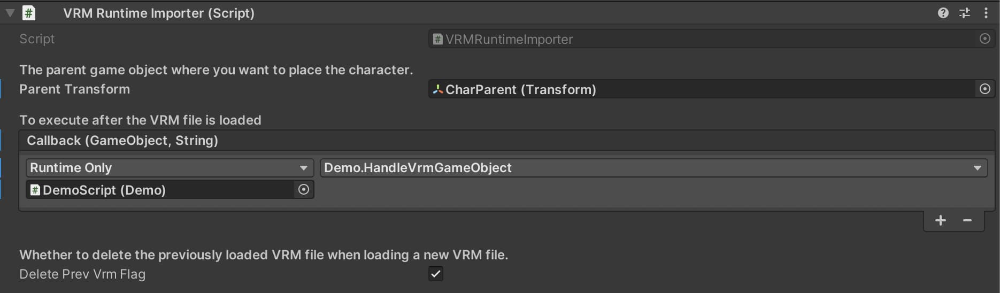
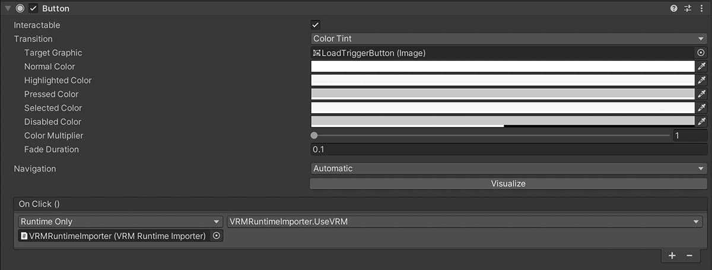

# VRM Runtime Importer

Unity製のアプリケーションの実行中にVRMファイルをロードして画面内にキャラクターを追加するためのパッケージです。

このパッケージはUniVrmとRuntime File Browserを含んでいます。(これらはどちらも無料公開されているアセットです。)

* [UniVrm](https://github.com/vrm-c/UniVRM)
* [Runtime File Browser](https://assetstore.unity.com/packages/tools/gui/runtime-file-browser-113006?aid=1011liAjm)

UniVrmのバージョンはv0.92.0です。

unipackageファイルをあなたのUnityプロジェクトにドラッグ&ドロップしてください。

[VrmRuntimeImporter_1_0_0.unitypackage](https://github.com/EvelynGameDev/VRMRuntimeImporter/releases/)

## 使い方

<!-- 以下の[Youtube動画](http://www.youtube.com/watch?v=)にて使い方を詳しく解説しています。 -->

<!--  -->

デモシーンを用意しているので、そちらを参照すると使い方がわかりやすいと思います。

__VRMRuntimeImporter Prefab__

VRMRuntimeImporterというプレハブを用意しているので、あなたが使いたいシーンに追加してください。

ParentTransformにキャラクターのゲームオブジェクトを表示させたい親要素を設定できます。

また、Callbackに登録した関数はVRMファイルのロード後に実行されます。引数としてキャラクターのゲームオブジェクトを受け取ることができます。

VRMRuntimeImporterクラスのUseVRMメソッドを使用すると、ファイルブラウザが開きます。そしてファイルブラウザでVRMファイルを選択するとVRMファイルの3Dモデルが画面に登場します。

## ライセンス

[MIT](./Doc/LICENSE.txt)

## 作者

Evelyn GameDev

* [Youtube](https://www.youtube.com/c/EvelynGameDev)
* [Twitter](https://twitter.com/EvelynSoloDev)
* [Blog](https://gamedev.soarhap.com/)

もしこのプロジェクトを気に入っていただけたら、Ko-fiで活動を応援してもらえると非常に嬉しいです。

## English README is here

[Endlish README](./README.md)
