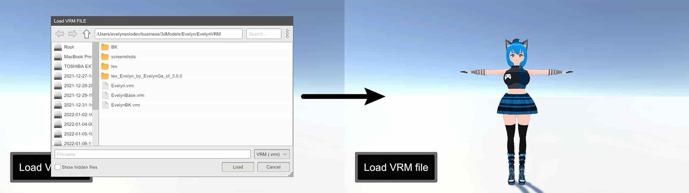
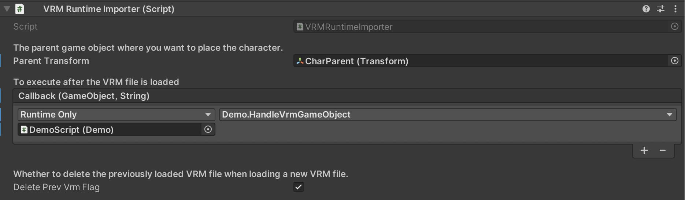
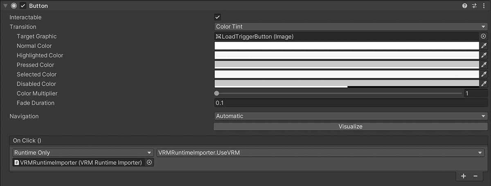

# VRM Runtime Importer

Unity製のアプリケーションの実行中にVRMファイルをロードして画面内にキャラクターを追加するためのパッケージです。



このパッケージはUniVrmとRuntime File Browserを含んでいます。(これらはどちらも無料公開されているアセットです。)

* [UniVrm](https://github.com/vrm-c/UniVRM)
* [Runtime File Browser](https://assetstore.unity.com/packages/tools/gui/runtime-file-browser-113006?aid=1011liAjm)

UniVrmのバージョンはv0.92.0です。

unipackageファイルをあなたのUnityプロジェクトにドラッグ&ドロップしてください。

[VrmRuntimeImporter_1_0_0.unitypackage](https://github.com/EvelynGameDev/VRMRuntimeImporter/releases/)

## 使い方

<!-- 以下の[Youtube動画](http://www.youtube.com/watch?v=)にて使い方を詳しく解説しています。 -->

<!-- [](http://www.youtube.com/watch?v=QSpa_vyYA1Q) -->

デモシーンを用意しているので、そちらを参照すると使い方がわかりやすいと思います。

__VRMRuntimeImporter Prefab__

VRMRuntimeImporterというプレハブを用意しているので、あなたが使いたいシーンに追加してください。

ParentTransformにキャラクターのゲームオブジェクトを表示させたい親要素を設定できます。

また、Callbackに登録した関数はVRMファイルのロード後に実行されます。引数としてキャラクターのゲームオブジェクトとVRMのファイルパスを受け取ることができます。

```cs
[System.Serializable]
public class LoadCallbackEvent : UnityEvent<GameObject, string> { }
```



VRMRuntimeImporterクラスのUseVRMメソッドを使用すると、ファイルブラウザが開きます。そしてファイルブラウザでVRMファイルを選択するとVRMファイルの3Dモデルが画面に登場します。



__サンプル__

```cs
using UnityEngine;
using VRMRuntimeImporter;

public class Demo : MonoBehaviour
{
    [SerializeField] VRMRuntimeImporter VRMRuntimeImporter;

    private readonly string VRM_FILE_PATH_KEY = "VRM_FILE_PATH_KEY";

    // ゲームの起動時に前回選択したVRMファイルを読み込むサンプルです。
    private void Awake()
    {
        if (!PlayerPrefs.HasKey(VRM_FILE_PATH_KEY)) return;

        string path = PlayerPrefs.GetString(VRM_FILE_PATH_KEY);

        if (System.IO.File.Exists(path))
        {
            VRMRuntimeImporter.LoadVrm(path);
        }
    }

    // VRMRuntimeImporterのCallbackに登録することでゲームオブジェクトとVRMのパスを受け取れます。
    public void HandleVrmGameObject(GameObject go, string vrmFilepath)
    {
        Debug.Log("HandleVrmGameObject");
        Debug.Log(go);
        Debug.Log(vrmFilepath);
        PlayerPrefs.SetString(VRM_FILE_PATH_KEY, vrmFilepath);
        PlayerPrefs.Save();

        // TODO: Your game's own code here
    }

    // VRMRuntimeImporterのUseVRMメソッドを使うことでファイルブラウザが開いてVRMを選択できます。VRMファイルが選択された場合はロード処理が実行されます。
    public void OpenFileBrowser()
    {
      VRMRuntimeImporter.UseVRM();
    }
}
```

## ライセンス

[MIT](./Doc/LICENSE.txt)

## 作者

Evelyn GameDev

* [Youtube](https://www.youtube.com/c/EvelynGameDev)
* [Twitter](https://twitter.com/EvelynSoloDev)
* [Blog](https://gamedev.soarhap.com/)

もしこのプロジェクトを気に入っていただけたら、Ko-fiで活動を応援してもらえると非常に嬉しいです。

[](https://ko-fi.com/S6S52PWUR)

## English README is here

[English README](./README.md)
